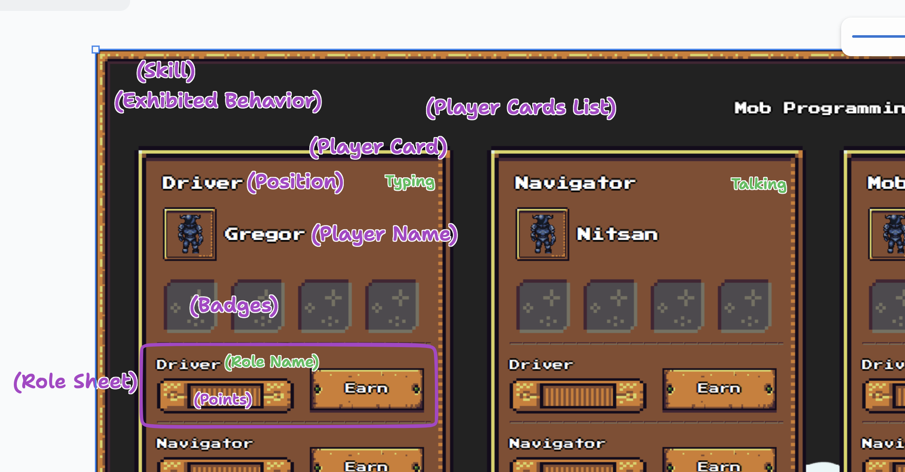

# Are ubiquitous language

We derive this from the Conversion with Willem below

## Our agreed terminology
https://beta.tldraw.com/r/v2_c_Nqp_KRwsJE-kWiSbPVrQo

# Conversiation with Willem

## Terminology
RoleName - Driver, Navigator, Researcher
Role has points and a RoleName and becomes a Badge (the hat you are wearing)
Place in the Rotation
Activity? Skill? XP?
Badge
Rolesheets = Playbooks (the things you have to do)
Spots/Position in a Rotation (e.g. DriverSpot) is like a chair in the rotation (the chair is not a role)

Roles vs Spots: You can spend many rounds on roles. In the position of a driver you can be many roles

Roles vs. Skills?

Individual Behaviors = Micro-Skills

Role - it's a paradigm, a hat

A Driver (a role) has skills e.g. Typing, Asking Question, Putting Blinders on, Respond to one person, constantly seeking better undertanding of tooling

A Driver shows behavior

the point of the game - talk about actual operation competency - what is actually observalbe

## Can the UI help solve this?

### greatest mob of all time - the GOAT!

track total points / badges over time

### reduce stress

Your first round - is stressful
You forget to do the behaviors
Mobbers are racking-up points - they could help the Driver and Navigator

Next (Wingman) -> Navigator -> Driver

Wingman:
- 

We're trying to automate the facilitator.

Most challenging part of game (says Willem) is when you are driving (or navigating), it is so stressful that your first spot in rotation (first time around)...
WHat happens is that you forget to do behaviors. (Driver might freak. Same for navigator). Getting buried in proble.
Willem has tried different behaviors (i.e. wing person). "Next" (about to be navigator). They watch navigator.
Flip side.... if you are in multi-person mob. You rack up points all the time. Celebrated a moment. They have loads of opportunities to slack back (or over focus) on getting _other_ roles to get points.
Keep track of total number of badges. Total points. Arcade game.
Richard Sheridan -- Menlo Labs -- Full-day interview. Your job is to make sure that SOMEONE ELSE gets a second interview.
Team score. Not individual score. It only matters that it opens up other badges. How many badges does the group (not me) have?
The mob is trying to accumulate badges. INDIVIDUALS get badges, but they accrue to MOB.
They can become a badge. Different from "place in rotation".
Could create more ornate navigator skills. Star pilot.
RoleName ... how to match to BadgeName. Is it a 1-to-1?
Looking at game....As driver spot in rotation, but working on research role, can you work on 2 roles at same time?

Some roles are attached to rotation.  Others are not.  Should be allowed to double up.

Role -- Play book.  Like a fighter has a play book.  Things they can do.  Role sheet.  Roles.
Are independent:
* Spots in rotation
* Roles

Disagreed with (Willem)
* Role is hat you are wearing as a mobber.

* Chair you are sitting in is not a role.

Spot in rotation is like position on sports team.  It may be a helpful model (or not).

Wing man is needed because you only have one crack "at bat".  The 2 hot spots provide limited opportunities to get points.

Nitsan -- another metaphor.  Only one person at the keyboard.  Only one person at the microphone.  Could be 100's of people not in those 2 hot spots.

Only 2 seats in the front of the bus.  Lot's of sheets in the back of the bus.FACILITATOR is game leader (not navigator).

Gregor pulled Willem in as SME.We added Willem as co-author of commit.

It's only team points (We focus on the Team, not the individual)